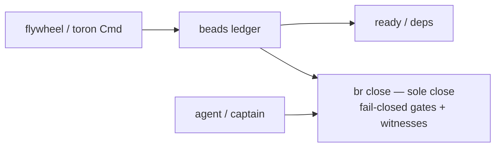
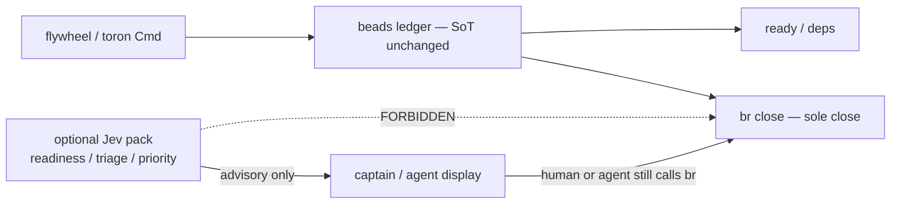

<!-- governed-by: ADR-0001, ADR-0004, ADR-0005, flywheel ADR-0014 (Proposed), toron ADR-0033 (Proposed), GS-054, GS-055 -->
---
status: proposed
date: 2026-09-19
decision-makers: Captain (bangedorrunt) — Proposed only; HOLD merge until captain ship word
consulted: |
  GS-054 System One / Jev scout (REJECT auto br close); TypeSafe System One primitives;
  beads ADR-0001 fail-closed work ledger; Firstmate lock GS-055 (beads ADR only);
  flywheel ADR-0014 / toron ADR-0033 Proposed companions
informed: flywheel × toron × beads maintainers
---

# ADR-0006: Jev never closes issues — beads remain sole close (Proposed)

| Field | Value |
|-------|-------|
| **Status** | **Proposed** — 2026-09-19. **HOLD merge** until captain ship word. **No implementation** of Jev adapters in beads. |
| **Decision-makers** | Captain (bangedorrunt) |
| **Extends** | [ADR-0001](0001-make-beads-the-fail-closed-work-ledger.md) (fail-closed ledger; sole close), [ADR-0004](0004-adopt-revisioned-witnessed-mutations.md) (witnessed mutations), [ADR-0005](0005-scout-ship-deliverable-and-captain-hold.md) (captain hold / deliverable types) |
| **Does not amend** | Close gate vocabulary; ready/deps graph as SoT for issue state; `br close` ownership; fail-closed doctor/gate report |
| **Does not wire** | Auto-close from Noul; Jev as work SoT; invent-green Redis for ranking |
| **Governs** (on acceptance) | Any System One / Jev use around beads is **advisory only**; beads alone closes; fail-closed ledger unchanged |
| **Tracker** | GS-055; GS-054 R5 REJECT auto `br close` |
| **Verification** | Captain word; no code in this PR that calls TypeSafe or auto-closes |

**Decision in one sentence:** TypeSafe Jev / System One **MUST NEVER** close beads issues — beads remains the **sole close** authority and fail-closed work SoT; optional readiness / triage / priority suggestions from Choice / Score / Noul packs are **advisory only** for captain or agent display, and the fail-closed ledger, gates, and witnessed mutations stay unchanged.

---

## 1. Why this ADR exists

GS-054 ranked **R5 — Auto `br close` from Noul** as an explicit REJECT. Companion ADRs (flywheel ADR-0014, toron ADR-0033) place Jev as a calibrated judgment leaf for DecisionReady / honesty / mail triage. Without a beads-side lock, a fashion import could:

- treat high Noul "definition of done met?" as license to `br close`,
- make TypeSafe a second work SoT beside the SQLite ledger,
- bypass captain hold (ADR-0005) or revisioned witnesses (ADR-0004).

This ADR is the beads-local refusal and the advisory-only allowance.

---

## 2. Tip baselines (GS-055)

| Repo | HEAD |
|------|------|
| **beads** `main` | `3fb001bbf07896d239078a22cce204d1da70b2c2` |
| **flywheel** `main` | `8914910e45afb5c4c392db90dfd601d68348b42b` |
| **toron** `main` | `a1359edcb8b4152fbffd8ccb235a1e4873c3a2b1` |

---

## 3. As-is vs to-be

### 3.1 As-is

### 3.2 To-be (Proposed)

---

## 4. Decision details

### 4.1 Hard rule — never close

1. No code path may map a Choice / Score / Noul answer to `br close`, legal verdict invent, or gate bypass.
2. No background job may auto-close on confidence threshold.
3. Captain hold (ADR-0005) cannot be cleared by Jev.
4. Jev is **not** a work SoT — issue state, deps, and close witnesses live only in beads.

### 4.2 Allowed advisory uses (optional, later, HOLD implement)

| Use | Shape | Bound |
|-----|-------|-------|
| Readiness suggestion | Noul "definition of done met given evidence?" | Display / Prompt only |
| Priority / triage | Score or composite Nouls | Code weights; queue SoT stays beads |
| Duplicate / align hint | Score levels (entity_alignment shape) | Curator queue; no auto-merge of issues |

All advisory outputs must be labeled as non-authoritative in any agent-facing text.

### 4.3 Fail-closed ledger unchanged

ADR-0001 stands: doctor, gate report, close policy, and revisioned witnessed mutations (ADR-0004) do not grow a "Jev said so" escape hatch. Offline / API failure of TypeSafe must not block `br` close/ready paths.

### 4.4 REJECT list (beads-facing)

1. Jev as **work SoT**.
2. Auto **`br close`** from any System One answer.
3. Invent-green **Redis/OTP** for bead ranking.
4. Dual ledger (cloud issue store + beads).
5. Clearing **captain hold** via model confidence.
6. Replacing gate witnesses with model prose.

---

## 5. Relationship to Tick Law / effect journal / profiles

| Plane | Role |
|-------|------|
| Tick Law | May *suggest* via host enricher; close still beads |
| Effect journal | May journal that an advisory pack was asked; journal ≠ close witness |
| Profiles | Unrelated; profiles stay pure data elsewhere |
| flywheel / toron ADRs | Judgment adapter must not call close |

---

## 6. Open questions

1. Should advisory readiness ever appear in `br ready` JSON as a non-gating field, or stay entirely outside beads CLI?
2. Who owns pack definitions for "done?" questions — flywheel or beads docs only?
3. Any interaction with scout-ship deliverable types (ADR-0005) for report beads citing Jev measurements?

---

## 7. Consequences

### Positive

- Prevents the most dangerous fashion import (auto-close).
- Keeps fail-closed semantics auditable.

### Negative

- Agents may still hope-close; this ADR forbids automation, not bad agent behavior — Prompt/chrome must reinforce.

### Neutral

- No beads code in this PR.

---

## 8. Acceptance

Captain marks **Accepted**. Until then: **Proposed**, **HOLD merge**, no TypeSafe integration in beads.

---

## 9. Sources

- GS-054 §3 R5, §5 REJECT #8
- GS-055 report
- ADR-0001, ADR-0004, ADR-0005
