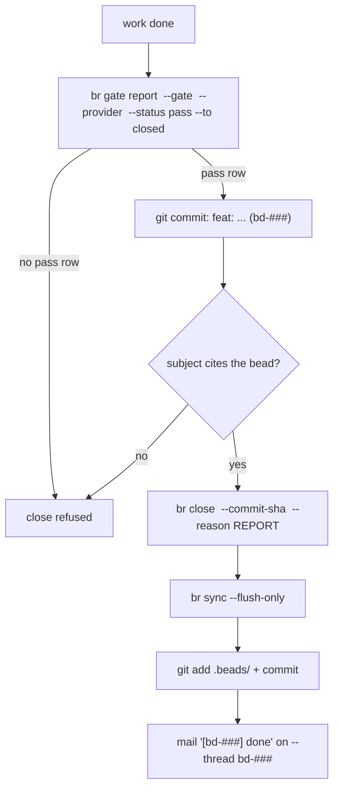

The close is where br earns "fail-closed". A close without a legal pass gate row and a `--commit-sha` is illegal. The sha is resolved and its commit message must cite the bead id; a sibling lane's commit, a beads-only commit, or an old HEAD fails loud. Verify before closing:

```bash
git show -s --format=%s <sha>     # must name your bead id
```

Commits are attributed: export `AGENT_NAME` (your pin); unattributed commits fail closed even under a shared lease. A VERIFY fence holding one runnable command closes only via `command-verified`: state the commands you actually ran. The pre-commit guard adds a second net: bead-tagged hunks in a staged diff must appear in the commit message, and commits are attributed to a pin.

## The sequence



```bash
export AGENT_NAME="<your-pin>"
br gate report <id> --gate unit-test-verified --provider "$AGENT_NAME" --status pass --to closed
git commit -m "feat: add retry to uploader (bd-z2d0)"
br close <id> --commit-sha "$(git rev-parse HEAD)" --reason "Implemented retry; commit ...; verdict unit-test-verified; ran <VERIFY cmd> => <tail>; deviations: none; PRINCIPLES: prove-it-works — ran the fence"
br sync --flush-only
git add .beads/ && git commit -m "chore(beads): close <id>"
```

The workflow per bead decides which gates the close transition requires; `br gate list <id> --json` shows the required-gate status (`gated_transitions`). Report only gates the workflow requires there; a gate name outside the list fails validation. When no gate is required, record the evidence row anyway (`br gate report --gate command-verified ... --status pass` without `--to closed`): the ledger keeps the receipt even when the transition is ungated.

Gate wrapper details: `flywheel ledger check` exits 0 only on a legal verdict for the current sha; `flywheel ledger receipt` writes the receipt file. Workers never write verdicts directly.

## One report, two channels

The close is one report with two copies:

- `--reason`: durable, ledger-gated, the canonical record.
- `toron mail send --to captain --thread <id> --subject "[<id>] done"`: the captain's copy. The captain has no push channel; without this mail the close is invisible to whoever coordinates.

Same REPORT fields in both: status, commit sha, verdict, command + result tail, deviations, principles cited.

## Close-side gates elsewhere in the stack

| Gate | Enforced by |
|---|---|
| Pass row for the gates the workflow requires | `br close` |
| Sha must cite the bead | `br close` resolution |
| Bead-tagged diff hunks must appear in the commit message | pre-commit strict guard |
| Attributed commits | pre-commit strict guard (`AGENT_NAME`) |
| Catalog freshness | CI test against `toron catalog` |
| Reservation guard | pre-commit hook (`toron guard install`) |
| Presence-gated closes | `br doctor` flags closes from pins with no live arrival (P5); fix is the door retroactively plus a note in the close reason |

Anti-pattern, stated once: `br close <id> --reason "..."` with no gate row and no sha. Cold agents copy that shape from old transcripts and false-close. The legal path is always gate, work commit, close with that sha.

## Which verdict is legal

The gate engine enforces a verdict legality matrix (source: `src/verify.rs`), so the gate name is not free-form:

| Bead shape | Legal closing verdicts |
|---|---|
| P >= 2, blast Normal, VERIFY loop-runnable | `command-verified` only |
| P >= 2, blast Normal, VERIFY not loop-runnable | `worker-receipt`, `triage-verified`, `unit-test-verified`, or `live-verified` |
| P <= 1, or blast High | `unit-test-verified` or `live-verified` only |
| P <= 1, blast Normal, ordered by a human | `operator-directed` (the provider names the human) |
| Acceptance is judgment | `reviewer-signed` only |
| Any | never a FAIL row, never missing |

Two refusal rules bite docs and report beads especially: a **report close** (ADR-0005 §2) refuses `unit-test-verified` outright (there is no code under test, so the verdict would be a false witness), and `command-verified` is illegal at P <= 1. `br close --force` still requires the gate row and the cited sha; force never waives evidence. `--suggest-next` attaches follow-up suggestions to the close.
