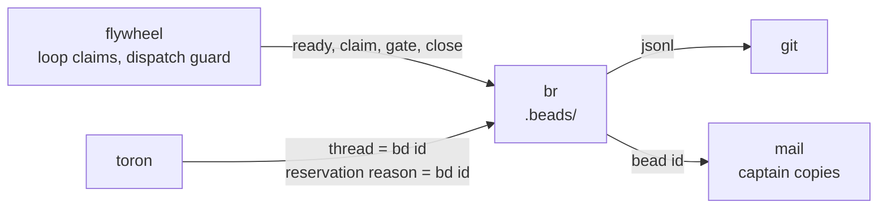

br is the stack's work ledger: local-first, dependency-aware, fail-closed at the two moments that matter. Claiming: `ready` and `next` surface only dispatchable work. Closing: a close needs a recorded pass gate row and a commit sha whose message cites the bead. Everything in between is ordinary issue tracking.

Binary is `br`, never `bd` (that is the old Go version). br never runs git; sync and commits are your job. br touches only `.beads/`.

## Storage

```
.beads/
  beads.db        # SQLite, WAL mode; primary storage
  beads.db-wal    # write-ahead log
  beads.db-shm    # shared memory
  issues.jsonl    # JSONL export, the git-facing copy
  config.yaml     # project configuration
  metadata.json   # workspace metadata
```

Sync is explicit, never automatic: `br sync --flush-only` exports DB to JSONL before a commit; `br sync --import-only` imports after a pull. Output is `--json` for agents, `--format toon` for token-tight contexts, human-colored on a TTY.

## Where it sits



The bead id is the stack's join key: mail thread, reservation reason, commit-message citation, gate rows, and the flywheel dispatch header all carry it.

## Pages

| Page | Read when |
|---|---|
| [quick-start](./quick-start) | First workspace, first bead |
| [lifecycle](./lifecycle) | States, dispatchability, claims, staleness |
| [close-ceremony](./close-ceremony) | Gates, sha citation, the done report |
| [graph-analysis](./graph-analysis) | Dependencies, triage, plans, insights |
| [cli-reference](./cli-reference) | The command surface |
| [troubleshooting](./troubleshooting) | Anti-patterns and diagnostics |
