## States

```mermaid
stateDiagram-v2
    [*] --> open : create
    open --> in_progress : claim (assignee = herdr slug)
    in_progress --> in_progress : work; gate rows accumulate
    in_progress --> closed : gate pass + sha citing the bead
    open --> closed : same ceremony
    closed --> open : reopen
```



`ready`, `blocked`, and `deferred` are views over `open`, not separate states. `br ready` returns open, unblocked, not-deferred, and dispatchable. `br blocked` names the blockers. `br defer` schedules for later.

## Fields

| Field | Values |
|---|---|
| priority | 0 critical, 1 high, 2 medium (default), 3 low, 4 backlog |
| type | `task`, `bug`, `feature`, `epic`, `question`, `docs` |
| labels | free-form, comma-separated on create, `label add/remove` after |
| parent | epic linkage via `--parent` |
| verify | the single-line VERIFY command (`--verify '<cmd>'`) |
| principles | `--principle '<name> — <decision it changed>'` (repeatable) |

## Dispatchability

`ready` and `next` gate on both:

1. **VERIFY fence.** A `## VERIFY` heading plus exactly one fenced single-line command. Missing, multi-line, or empty means not ready, and the planner is mailed once on the bead thread.
2. **Principles (P<=2).** `## PRINCIPLES` with one citation line per principle. A canonical name with no decision clause is a skip.

An empty ready set with open, unblocked beads is a diagnosis, not a mood: `No dispatchable issues — N bead(s) lack VERIFY ...`. `br next` degrades with the named reason when the top pick fails the gate.

Wave labels ride the label field (`wave-N`): flywheel's loop holds wave-N while any lower wave is open. Label-based, transitional, until the typed wave field ships.

## Claims and staleness

Agent claims go stale after about 2 hours without `updated_at` movement; human or unclear claims after about a business day. A live reservation, a recent comment, or dirty files in the same paths means the claim is still active.

Reclaim protocol: audit comment first, then claim. `br coordination` diagnoses swarm coordination state without mutating claims.

Toron down: claim with an explicit assignee, record the intended file scope in a bead comment, check `git status` plus `br list --status in_progress` for collisions, keep the scope minimal, and note the degraded coordination in the close reason.

## Bulk operations

```bash
br update --actor "$ACTOR" <id1> <id2> <id3> --priority 2 --add-label triage-reviewed --json
br comments add --actor "$ACTOR" <id> --message "note" --json
br defer <id> --until 2026-09-14
```
